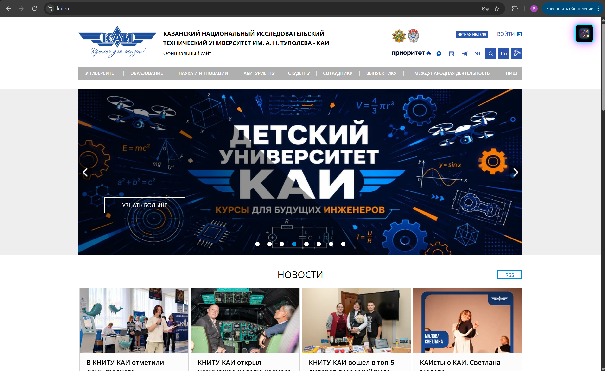
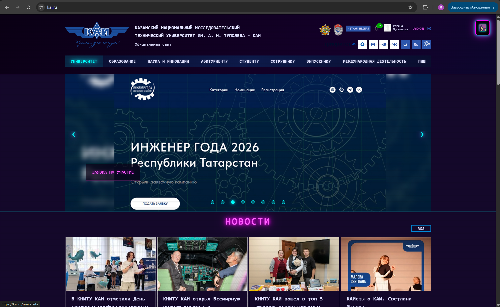
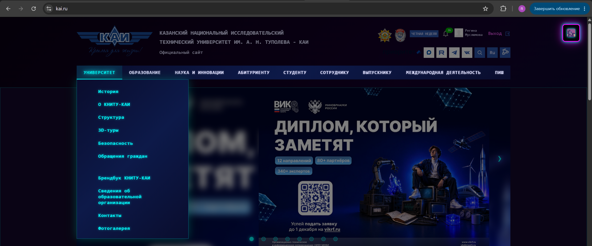
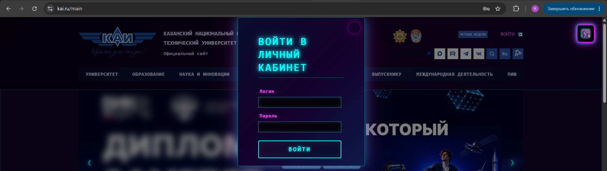
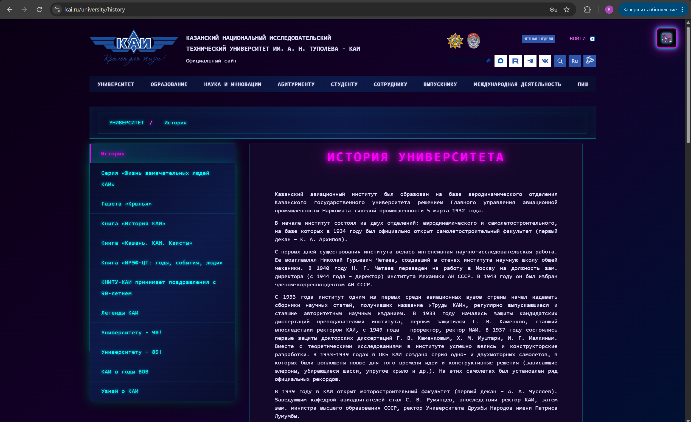
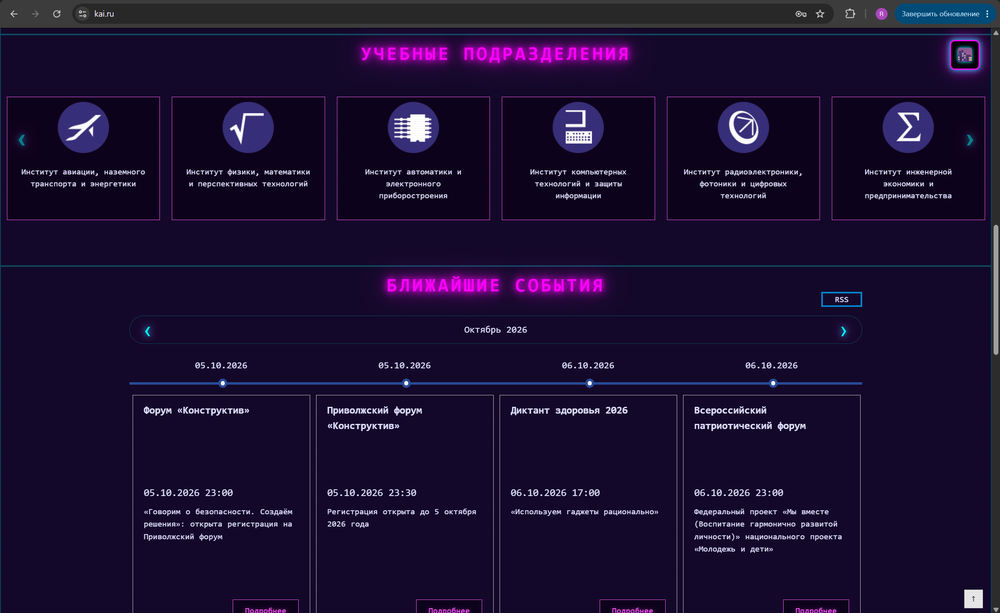

Cyberpunk / Neon Noir Plugin for kai.ru

Плагин для Google Chrome / Yandex Browser, который меняет стиль сайта [kai.ru](https://kai.ru) 
в стиле Cyberpunk / Neon Noir — тёмный фон, неоновые акценты, эффекты свечения

Описание проекта

При включении плагина сайт kai.ru полностью меняет оформление:

- Фон страницы — глубокий тёмный градиент
- Акценты — неоново-голубой
- Заголовки — светящиеся розовым неоном
- Ссылки — розовые с эффектом glow, при наведении — голубые
- Карточки новостей — тёмно-фиолетовый фон с неоновой рамкой
- Кнопки — тёмные с голубой рамкой и свечением
- Сканлайны — эффект старого CRT-монитора
- Модальные окна — тёмные с неоновой обводкой
- Верхнее меню и подвал — тёмно-синий градиент
- Стрелки слайдера — стилизованы под неоновые символы `‹` и `›`

Всего изменено более 15 различных стилей (цвета, фоны, границы, отступы, тени, шрифты)

Функциональность

- Кнопка переключения в правом верхнем углу страницы
- Статус стиля отображается эмодзи: 🌃 — выключен, 🌆 — включён
- Сохранение состояния — выбранная тема сохраняется в `localStorage` и восстанавливается после перезагрузки страницы
- Работает на всех страницах kai.ru — главная и внутренние разделы
- CSS-классы — стили применяются через класс `.cyberpunk-mode`, а не через прямое изменение inline-стилей

Инструкция по установке

Установка в Google Chrome
1. Скачай или склонируй папку `style-plugin` из репозитория
2. Открой браузер и перейди по адресу: chrome://extensions/
3. Включи Режим разработчика 
4. Нажми кнопку Загрузить распакованное расширение
5. В открывшемся окне выбери папку `style-plugin`
6. Плагин установлен — иконка появится на панели расширений

Использование

1. Открой https://kai.ru
2. В правом верхнем углу появится кнопка 🌃
3. Нажми на неё — стиль включится, эмодзи изменится на 🌆, а сайт станет неоновым.
4. Нажми ещё раз — тема отключится
5. Перезагрузи страницу — состояние сохранится автоматически

Скриншоты

До включения плагина

После включения плагина

Структура проекта
style-plugin/
├── manifest.json # Описание расширения
├── content.js # Логика плагина (создание кнопки, переключение, localStorage)
├── style.css # Все стили Cyberpunk / Neon Noir
├── readme.md # Документация
└── images/

Технологии и методы

JavaScript:
- `document.getElementById()` — поиск элементов по ID
- `document.querySelector()` — поиск по CSS-селектору
- `document.querySelectorAll()` — поиск нескольких элементов
- `element.parentElement` — родительский элемент
- `element.children` — дочерние элементы
- `localStorage` — сохранение состояния плагина
- Сложный CSS-селектор с двумя классами: `.news_box.active, .card.highlight`

CSS:
- CSS-переменные цвета и градиенты
- `text-shadow` — эффекты неонового свечения
- `box-shadow` — свечение вокруг элементов
- `repeating-linear-gradient` — эффект сканлайнов
- `transition` — плавные анимации
- Класс `.cyberpunk-mode` — вместо inline-стилей